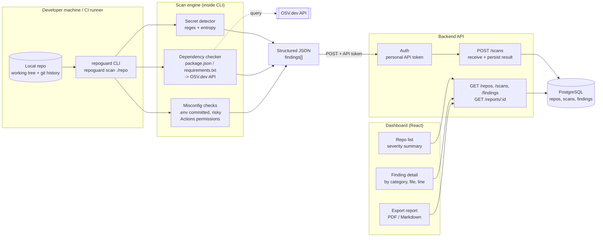

# End-to-end flow

CLI scans a repo → posts the structured result to the API → dashboard reads
it from the API and renders it. The CLI never talks to the dashboard
directly, and the dashboard never scans anything itself — the API is the
only contract between the two.

## Key decisions this diagram locks in

- **The CLI does all scanning locally.** Source code never leaves the
  developer's machine except as the already-redacted/structured findings
  JSON (file + line + finding metadata — not raw file contents). This is
  what "local-first" means for RepoGuard in practice.
- **The API is dumb on purpose.** It persists what the CLI sends and serves
  it back; it does not re-scan or re-interpret findings.
- **OSV.dev is called from the CLI, not the backend** — dependency data is
  part of the scan, resolved before the result is ever sent over the wire.
- **Auth is a personal API token for the CLI**, separate from the
  session-based login used by the dashboard (see task 6, "Autenticación y
  autorización reales").
