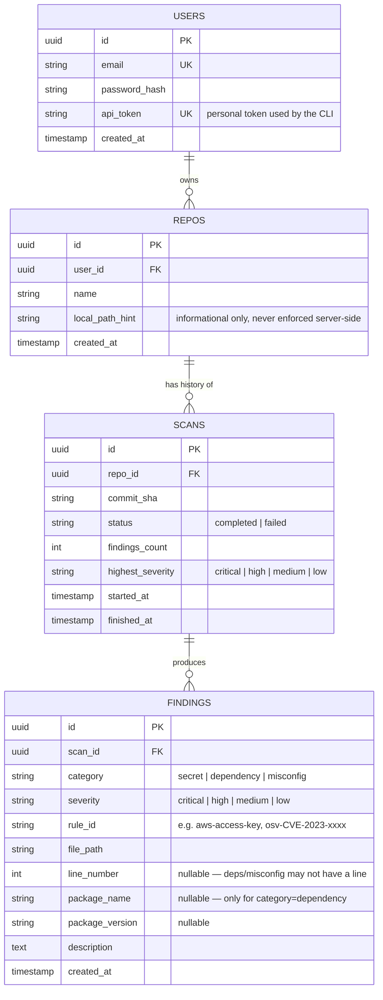

# Data model

Four core entities: users, repos, scans, findings. A scan belongs to a repo
and a repo belongs to a user; a scan produces many findings.

## Notes

- **`repos` has no notion of a git remote URL as a required field** — a repo
  scanned locally may never be pushed anywhere. `local_path_hint` is purely
  informational (shown in the dashboard for context), never used for access
  control or re-fetching.
- **`scans.commit_sha`** ties a scan to the exact commit that was scanned,
  which is what makes the "evolution of findings over time" chart (task 7)
  possible — plot `findings_count` per scan, ordered by `finished_at`.
- **`findings.rule_id`** is intentionally a free-form string rather than a
  foreign key to a `rules` table — v1 has no user-editable rule config
  (see [02-research-gitleaks-trufflehog.md](02-research-gitleaks-trufflehog.md)),
  so rules live in the CLI's code, not the database.
- Access control (task 6) is enforced at the query layer: every `SCANS` /
  `FINDINGS` lookup joins through `REPOS.user_id = current_user.id` — there
  is no separate ACL table for v1, ownership is the only access rule.
